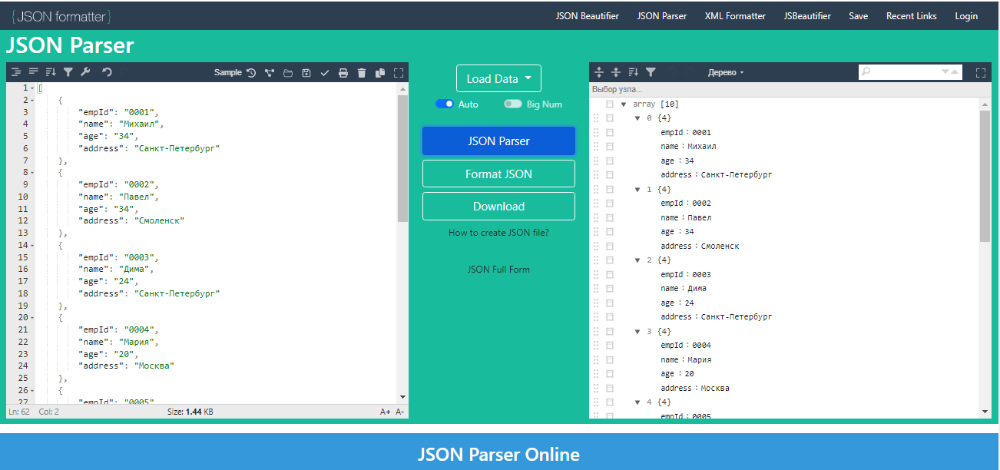

# Урок 5. JSON и XML
~~~
Формат сдачи ДЗ - один архив(.zip; .7z), со всеми файлами, либо ссылкой на github.
~~~
________________________________________
## Задача №1: 
Проверить XML, правильно ли он составлен, не имеет ли он ошибок, если есть какие-либо недочеты, предоставьте правильный вариант в файле 1.xml
```
<req>
<surname>Иванов</surname>

<name>Иван</name>

<patronymic>Иванович</patronymic>

<birthdate>01.01.1990</birthdate>

<birthplace>Москва</birthplace>

<phone>8 926 766 48 48</phone>
</req
```
Исправленный фаил:
```
<?xml version = "1.0">
<req>
    <surname>Иванов</surname>

    <name>Иван</name>

    <patronymic>Иванович</patronymic>

    <birthdate>01.01.1990</birthdate>

    <birthplace>Москва</birthplace>

    <phone>8 926 766 48 48</phone>
</req>
```
Добавил заголовок, недостающую закрывающую скобку в конце после ___req___, отформатировал.
________________________________________
## Задача №2: 
Проверить JSON, правильно ли он составлен, не имеет ли он ошибок, если есть какие-либо недочеты, предоставьте правильный вариант в файле 2.json:
```
{
"surname": "Иванов"

"name": "Иван"

"patronymic": "Иванович"

"birthdate": "01.01.1990"

"birthplace": "Москва"

"phone": "8 926 766 48 48"
}
```
Исправленный фаил:
```
{
    "notebook": [
        {
            "surname": "Иванов",
            "name": "Иван",
            "patronymic": "Иванович",
            "birthdate": "01.01.1990",
            "birthplace": "Москва",
            "phone": "8 926 766 48 48"
        }
    ]
}
```
Добавил наименование массива, поставил недостающие запятые, отформатировал.
________________________________________
## Задача №3: 
Составить json по таблице, созданной при выполнении 4-го дз. (информация об одногруппниках с четырьмя полями: id, name, age, address.) Ответ представить в виде файла 3.json и прикрепить скрин, отображающий вид таблицы.


